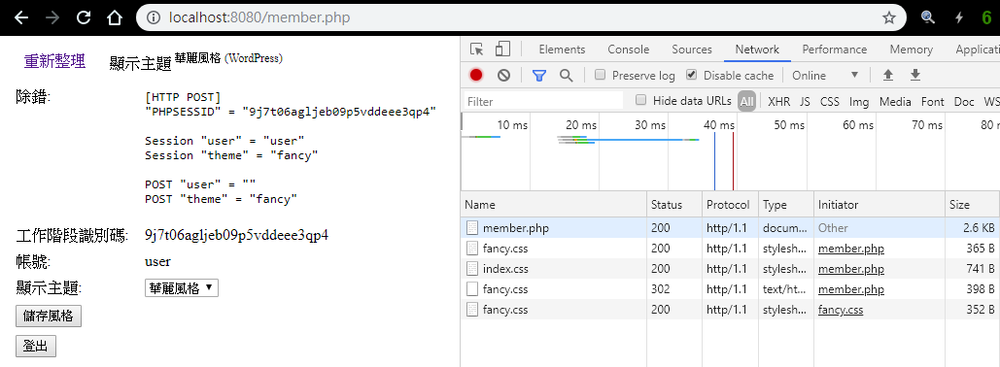

# phpUserContent

## 載入首頁
GET http://localhost:8080/member.php

## 登入
POST http://localhost:8080/member.php

user=user&pwd=password

## 儲存風格
POST http://localhost:8080/member.php

task=theme&theme=custom

## 登出
POST http://localhost:8080/member.php

task=logout

GET 導回首頁。

## 網頁樣式

### 首頁風格
**`/assets/css/index.css`**

### 自訂風格
~~**`/assets/css/custom.css`**~~  
**`/member/css/custom.css`**  
**`/wp_member/css/custom.css`**

### 華麗風格
~~**`/assets/css/fancy.css`**~~  
**`/member/css/fancy.css`**  
**`/wp_member/css/fancy.css`**

## 網址改寫
**`.htaccess`**

遇到 **`/assets/css/`** 路徑底下不存在的 **`custom.css`** 檔案或資料夾，則改寫為 **`member.php?task=assets&theme=custom`**，仿照路由機制導回 /index.php 統一決定路由。

### 重新導向到路徑
**`/member/css/custom.css`**

## WordPress 方式
**`/wp_member/css/custom.css`**

直接指定風格路徑，由 **`$_SESSION['theme']`** 決定。

## 改用有效率又不消耗記憶體的串流讀檔傳輸
不使用 302 Found 重新導向方法。

### 參考文章
[How to Read Big Files with PHP (Without Killing Your Server) — SitePoint](https://www.sitepoint.com/performant-reading-big-files-php/)
